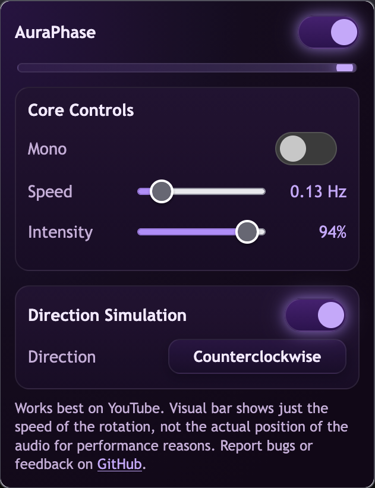

# AuraPhase

AuraPhase is a Firefox add-on that creates an orbit-style spatial illusion for any page audio. It combines panning (ILD) with a short Haas delay (ITD) to make the stereo image feel like it is moving around the listener.

## Screenshot

## Controls

- Enable toggle: master on/off for the effect.
- Mono: sums L+R to mono before processing.
- Speed: LFO speed in Hz for the orbit motion.
- Intensity: overall depth for pan and delay.
- Direction simulation: enables the ITD motion and direction logic.
- Direction: toggles the orbit direction (clockwise/counterclockwise).

## Algorithm (high level)

1. Split the incoming audio into left and right channels.
2. Apply a subtle interaural time difference (Haas delay) with a modulated delay time per channel.
3. Apply interaural level difference (stereo panner) driven by the same LFO.
4. Optionally sum to mono before processing for a more centered image.
5. Limit and gain-compensate the output to keep levels stable.

## Files

- content.js: audio graph and effect processing.
- popup.html / popup.js: UI and state management.
- manifest.json: extension manifest.
